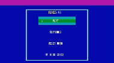

# TETRIS OS

LPythonとCPython + llvmliteで開発している、32-bit x86向けの自作OSです。
GRUB Multiboot2からベアメタルで起動し、Pythonインタプリタを載せるのではなく、LPythonでカーネルをネイティブコードへコンパイルします。

<p align="center">
  
</p>

## 主な機能

- 640×480・32-bit framebufferによるGUI
- ENDLESS、MARATHON、SPRINT 40
- 7-bag、NEXT、HOLD、Ghost piece、T-spin判定
- ライン消去演出、コンボ、スコア、ハイスコア、統計、実績
- PITベースの落下・入力タイミング制御
- PCスピーカーによるBGMと効果音
- カラーテーマ、操作方法、音量、落下速度などの設定
- ATA PIOドライバと独自TinyFSによる永続化
- ELF32ローダーとCLI
- OS内Forthコンパイラ
- 拡張機能API、バックグラウンド処理、イベント、通知、権限管理

## 拡張機能

TETRIS OS向けに作成した現在の拡張機能一式は、本体とは別のリポジトリで公開しています。

- [qbju/tetris-ext — TETRIS OS Extensions](https://github.com/qbju/tetris-ext)

拡張のソース、サンプル、追加テーマ、アプリケーションなどは上記リポジトリを参照してください。本リポジトリはOS本体、カーネル、ビルド環境を管理します。

## アーキテクチャ

```text
boot/boot.S
  Multiboot2ヘッダ、スタック初期化、kernel_main呼び出し

kernel/main.py
kernel/parts/*.inc.py
  LPythonで記述したカーネル、Tetris、UI、ストレージ、拡張基盤

tools/gen_kernel_source.py
  分割されたカーネルソースをbuild/kernel.pyへ結合

tools/gen_hw_object.py
  CPython + llvmliteでi386 ELFオブジェクトを生成
  framebuffer、フォント描画、in/out、低レベルI/Oを担当

extension/ELFRUNNER.PY
  ELF32ローダー、CLI、TinyFS操作、OS内Forthコンパイラサービス

boot/boot.S → boot.o ┐
LPython → kernel.o   ├→ LLD → kernel.elf → GRUB ISO
llvmlite → hw.o      ┘
```

手書きアセンブリは起動に必要な最小部分だけです。ポートI/Oなどのハードウェア境界は、CPython + llvmliteがLLVM IRとインラインASMから生成します。

## 必要なもの

- Docker Desktop
- Docker Compose
- QEMU

LPython、llvmlite、Clang、LLD、GRUB、xorrisoなどの開発環境はDockerイメージ内に用意されます。

## ビルド

```powershell
docker compose build
docker compose run --rm osdev make
```

生成物：

```text
build/pythonos.iso
build/kernel.elf
storage/pythonos-data.img
```

データディスクは16 MiBです。保存データを維持したい場合は、`storage/pythonos-data.img`を削除しないでください。

## QEMUで起動

### Windows GUI・音声あり

```powershell
qemu-system-i386 -boot d -cdrom build/pythonos.iso `
  -drive file=storage/pythonos-data.img,format=raw,if=ide,index=0 `
  -display sdl `
  -audiodev dsound,id=snd0 `
  -machine pcspk-audiodev=snd0 `
  -no-reboot -no-shutdown
```

### Docker + VNC

```powershell
docker compose run -d --service-ports --name pythonos-vnc osdev sh -c "qemu-system-i386 -boot d -cdrom build/pythonos.iso -drive file=storage/pythonos-data.img,format=raw,if=ide,index=0 -display none -vnc 0.0.0.0:0 -no-reboot -no-shutdown"
```

VNCクライアントから`127.0.0.1:5900`へ接続します。VNC経由ではPCスピーカー音声は転送されません。

## 基本操作

| キー | メニュー | ゲーム |
|---|---|---|
| `↑` / `↓` | 項目移動 | 回転 / ソフトドロップ |
| `←` / `→` | 値・モード変更 | 左右移動 |
| `Enter` | 決定 | 決定 |
| `C` | — | HOLD |
| `Esc` | 戻る | 一時停止してホームへ |
| `Shift` | 許可時にデバッグ表示 | 許可時にデバッグ表示 |

設定で矢印操作とWASD操作を切り替えられます。

## CLIとForth

CLIにはファイル・ディレクトリ操作、システム情報、ELF実行などのコマンドがあります。TinyFS上のForthソースは、OS内でi386 ELF32へコンパイルできます。

```text
EDIT TEST.FTH
```

最小例：

```forth
42 . CR
```

`Shift+Enter`で保存してからコンパイルします。

```text
FORTHC TEST.FTH
TEST
```

`TEST.ELF`はコンパイルしたカレントディレクトリへ登録されます。削除後は実行できません。

```text
RM TEST.ELF
TEST
```

対応する基本語：

```text
+ - * / MOD
DUP DROP SWAP OVER
. EMIT CR
```

## ストレージ

TinyFSはQEMUへ接続したIDEデータディスクをATA PIOで読み書きします。主な永続化対象は次のとおりです。

- ハイスコア、統計、実績
- 設定とカスタムデータ
- CLIで作成したファイルとディレクトリ
- OS内で生成したELF32プログラム

## プロジェクトの位置づけ

TETRIS OSは、Python系言語から実際のベアメタルOSを構築し、ゲーム、GUI、ストレージ、ELF実行、拡張機能まで一つの環境で動かす実験的なプロジェクトです。実用OSではなく、低レイヤー開発とPython/LLVMの可能性を探ることを目的としています。

## License

[MIT License](LICENSE)